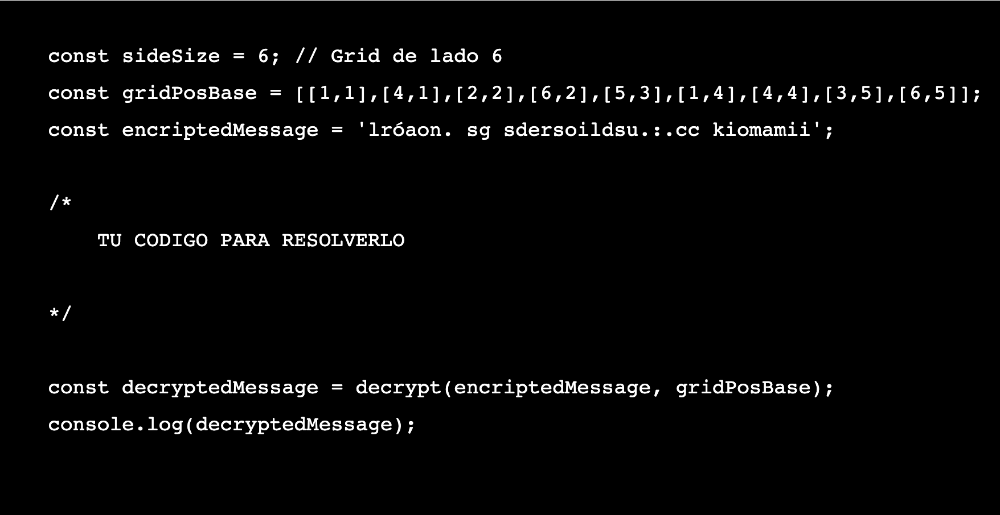
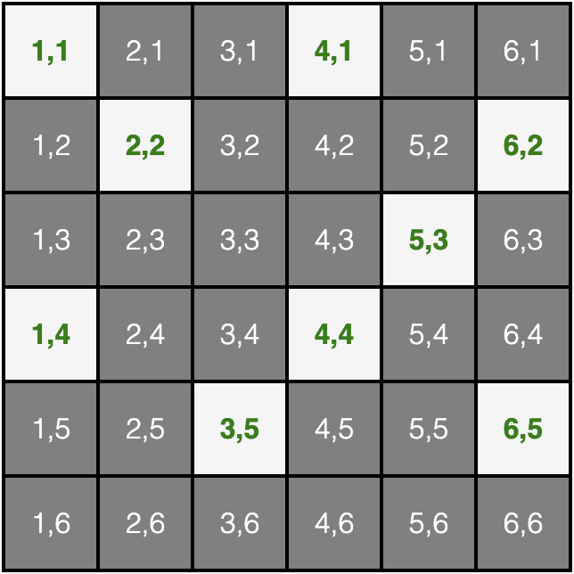
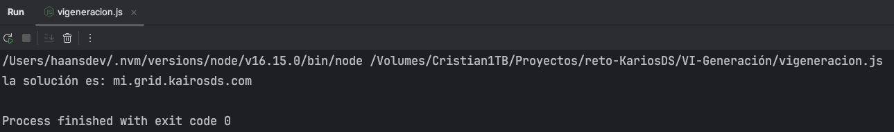

# Retos Generación K de KairosDS

En este repositorio propongo mis soluciones a los retos que KairosDS propuso en su día a través de sus RRSS.

Ambos retos son pasados, 2021 y 2022, pero no está de menos proponer soluciones alternativas, aportando distintas formas de poder hacerlo. Ambos son con JavaScript ES6.

### V Generación K - 2021

“Han sido descubiertos en Egipto los restos arqueológicos
de la tumba del faraón Nekgikis V, que destacó por ser un
faraón dador de oportunidades a los juniors developers egipcios de
hace más de 3000 años.

En su tumba se ha descubierto una frase y una serie de números que
los arqueólogos sospechan que, si logran descifrar, dará paso a una
url que les llevará a la solución de un misterio.

La traducción del mensaje dice: "Cómo será dar con Nekgikis V...".
Y la serie de números es: 23, 24, 25, 18, 19, 5, 6, 7, 20, 15, 17, 8, 10, 11, 4, 3, 12, 2, 16, 14, 9, 21, 0, 1, 13, 22.

Para poder descifrar el enigma deberemos tener en cuenta lo
siguiente:

● Sabemos que los egipcios no usaban espacios
● Sabemos que los egipcios no usaban mayúsculas
● Sabemos que los egipcios no usaban tildes
● Sabemos que la serie de números indica la verdadera posición
de cada letra de la url.

El reto lo enfoco de una forma más general, más allá del mensaje y posiciones numéricas dadas.

1- Creo una función anónima pasándole dos parámetros, el mensaje y las posiciones. Y formateo dicho mensaje, quitándo acentos, espacios y carácteres diacríticos (el enfoque
general).

2- Creo un array vacío para la url.

3- Creo un bucle para iterar a través del array serieNums, utilizando los valores en serieNums como índices en cada iteración del bucle, y asignar los valores correspondientes
de formatMessage a las posiciones respectivas en urlArray.

4- Creo un string, combinando los elementos de urlArray con el método .join(). Para acabar retornando el string.

5- Y finalmente, llamo a la función, como es un entorno de Node, lo hago a través de un console.log, pasando los parámetros.

```agsl
const decodUrl = (message, serieNums) => {
    const formatMessage = message.toLowerCase()
    .normalize('NFD')
    .replace(/\s/g, '')
    .replace(/[\u0300-\u036f]/g, '');

    let urlArray = [];
    
    for (let i = 0; i < serieNums.length; i++) {
        urlArray[serieNums[i]] = formatMessage[i];
    }
    
    let urlDecrypt = urlArray.join('');
    return urlDecrypt;
}

console.log(decodUrl('Cómo será dar con Nekgikis V...', 
    [23, 24, 25, 18, 19, 5, 6, 7, 20, 15, 17, 8, 10, 11, 4, 3, 12, 2, 16, 14, 9, 21, 0, 1, 13, 22]));
```

Resultado por consola:


### VI Generación K - 2022

Durante siglos, en tiempos de guerra, se ha necesitado
encriptar los mensajes para que el enemigo, en caso de
interceptarlos, no entendiera de qué se trataba.
Uno de los sistemas que se han utilizado es la codificación de Rejilla
criptográfica.

Los generales egipcios de Nekgikis VI, hijo del famoso Nekgikis V, usaban este método y, en una de las cámaras de la tumba del faraón, hemos encontrado un mensaje cifrado con este sistema.

El mensaje que hemos encontrado es:
lróaon. sg sdersoildsu.:.cc kiomamii
¿Podrías descifrar el mensaje usando código JavaScript?
Pistas para resolver el problema:
- Sabemos que usaron una rejilla de 6 x 6 celdas.
- Sabemos que las celdas abiertas están en las posiciones:
  [1,1],[4,1],[2,2],[6,2],[5,3],[1,4],[4,4],[3,5],[6,5] para el grid en posición inicial (0
  grados)
- El código JavaScript podría comenzar y terminar así:


    


- Podemos observar que cada vez que giramos la rejilla 90º en el sentido
  de las agujas del reloj la primera fila (eje x) pasa a ser la sexta columna
  (eje y), la segunda fila pasa a ser la quinta columna… y la sexta fila pasa a
  ser la primera columna.
- Una vez tienes todos los pares de coordenadas de todas las posiciones
  (0º, 90º, 180º y 270º) y ordenados, desencriptar el mensaje consiste en
  relacionar la posición de cada letra del mensaje con el par de
  coordenadas:: la primera letra del mensaje descifrado estará en la
  posición [1,1] la segunda letra del mensaje descifrado estará en la
  posición [4,1] la tercer letra del mensaje descifrado estará en la posición
  [2,2]...
- El grid usado es este:


    


Este reto también lo enfoco de manera general, decidiendo crear una clase.

1- Creo clase pasándole por constructor los parámetros del mensaje y las posiciones base de la cuadrícula.

2- A través del método, inicializo varios arrays y variables (gridMessage, lineaGridMessage, etc...).

3- En la variable sideSize asigno el tamaño de la cuadrícula, 6x6.

4- Establecido el tamaño de la cuadrícula, realizo un bucle asignando a cada posición de la cuádricula una coordenada, con valores de [1,1] a [6,6].

5- Realizo un bucle 4 veces, para intentar desencriptar el mensaje en 4 orientaciones diferentes según las posiciones del parámetro gridPosBase. Dentro de este bucle, se itera
arrayMessage, y estos carácteres se agrupan en lineaGridMessage.
Se recorre la cuadrícula y se verifica si las coordenadas coinciden con alguna de las posiciones de gridPosBase. Si hay coincidencias, el carácter de gridMessage se agrega a
arrayDecrypted. Y si la longitud de arrayDecrypted no es = a la longitud de arrayMessage original, la cuadrícula rota.

6- Una vez terminado el bucle, el método devuelve arrayDecrypted en una sola cadena

```agsl
class Decrypt {
    constructor(encriptedMessage, gridPosBase) {
        this.encriptedMessage = encriptedMessage;
        this.gridPosBase = gridPosBase;
    }
    
    decrypt() {
        const gridMessage = [];
        let lineaGridMessage = [];
        const arrayDecrypted = [];
        let grid = [];
        let gridLinea = [];
        const arrayMessage = Array.from(this.encriptedMessage);
        const sideSize = 6;
        
        for (let li = 0; li < sideSize; li++) {
            for (let col = 0; col < sideSize; col++) {
                const valor = [col + 1, li + 1];
                gridLinea.push(valor);
            }
            grid.push(gridLinea);
            gridLinea = [];
        }
        
        for (let giros = 0; giros < 4; giros++) {
            arrayMessage.forEach((item, i) => {
                if (lineaGridMessage.length < sideSize) {
                    lineaGridMessage.push(item);
                } else {
                    gridMessage.push(lineaGridMessage);
                    lineaGridMessage = [item];
                }
            });
            
            grid.forEach((gridRow, j) => {
                gridRow.forEach((gridCell, k) => {
                    this.gridPosBase.forEach((base) => {
                        if (
                            gridCell[0] === base[0] &&
                            gridCell[1] === base[1]
                        ) {
                            arrayDecrypted.push(gridMessage[j][k]);
                        }
                    });
                });
            });
            
            if (arrayDecrypted.length < arrayMessage.length) {
                grid.reverse();
                
                for (let n = 0; n < grid.length; n++) {
                    for (let p = 0; p < n; p++) {
                        const temp = grid[n][p];
                        grid[n][p] = grid[p][n];
                        grid[p][n] = temp;
                    }
                }
            }
        }
        
        return arrayDecrypted.join("");
    }
}
```


7- Una vez creada la clase con el constructor y el método con la lógica. Se establece las posiciones por coordenadas para desencriptar el mensaje del reto.

8- Se crea la instancia a partir de la clase Decrypt, y se le pasa su método decrypt() para desencriptar el mensaje.

9- Finalmente, se obtiene por consola el mensaje desencriptado.

```agsl
const gridPosBase = [
[1, 1],[4, 1],[2, 2],
[6, 2],[5, 3],[1, 4],
[4, 4],[3, 5],[6, 5]
];
const encriptedMessage = 'lróaon. sg sdersoildsu.:.cc kiomamii';

const decryptInstance = new Decrypt(encriptedMessage, gridPosBase);
const decryptedMessage = decryptInstance.decrypt();

console.log(decryptedMessage)
```

Resultado:



